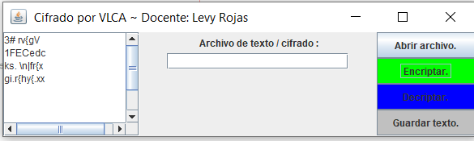

# Encriptado Vigenere modificado para guardar en un txt.

Problematica que se desarrollo:

*Se desarrollo un programa que implemento una aplicación con GUI para el cifrado de archivos de texto con el algoritmo de cifrado Vigenère.*

Se creo un programa de cifrado simple. El proceso es muy sencillo. Se divide en dos partes.
 En primer lugar, cada letra mayúscula o minúscula debe desplazarse tres posiciones
hacia la derecha, de acuerdo con la tabla ASCII: la letra ’a’ debe convertirse en la letra
’d’, la letra ’y’ debe convertirse en el carácter ’—’, etc. En segundo lugar, cada línea debe
invertirse. Después de invertir, todos los caracteres de la mitad en adelante (truncado) deben
moverse una posición a la izquierda en ASCII. En este caso, ’b’ se convierte en ’a’ y ’a’ se
convierte en ’‘’.

Por ejemplo, si como entrada tenemos la cadena abcABC1 si la palabra resultante de la
primera parte es ”defDEF1”, las letras ”DEF1”deben moverse una posición a la izquierda.
Sin embargo, si la palabra resultante de la primera parte es ”tesA”, las letras ”sA”serán
desplazadas. El resultado cifrado de la cadena es 1FECedc.

# *Link del funcionamiento del programa.*
https://flipgrid.com/86b87252

# -Pre-requisitos 📋
*Se necesita tener las librerias, el github y un IDE.
NetBeans 8.2 y GIT*
# Elementos visuales y funcionamiento.

*1.- Guardar(Se almacena la informacion en el archvio).*

*2.- Encripta(Se aplica el metodo usado para encriptar).*

*3.- Desencriptar(Se revierte el efecto de encriptar para obtener el texto original).*

*4.- Abrir archivo(Se busca el nombre del archivo que se ingreso antes para ver la informacion almacenada).*

*5.- Se coloca los datos en el textArea para poder empezar a trabajar.*

# Pueden utilizar estas cadenas como prueba.

*Texto #3*

*abcABC1*

*vxpdylY .ph*

*vv.xwfxo.fd*
	
-Cadenas resultantes (respectivamente)

*3# rvzgV*

*1FECedc*

*ks. \n{frzx*

*gi.r{hyz-xx.*

# *Agradecimientos. 

 *A nuestro docente por alentarnos y a mi por esforzarme.*

# Referencias.

*https://es.wikipedia.org/wiki/Cifrado_de_Vigen%C3%A8re*
*https://anabelisa.co/readme/*
*file:///C:/Users/valti/Downloads/Como%20programar%20en%20Java%20-%207ma%20Edicion%20-%20P.%20J.%20Deitel.pdf*

# Resultados.

